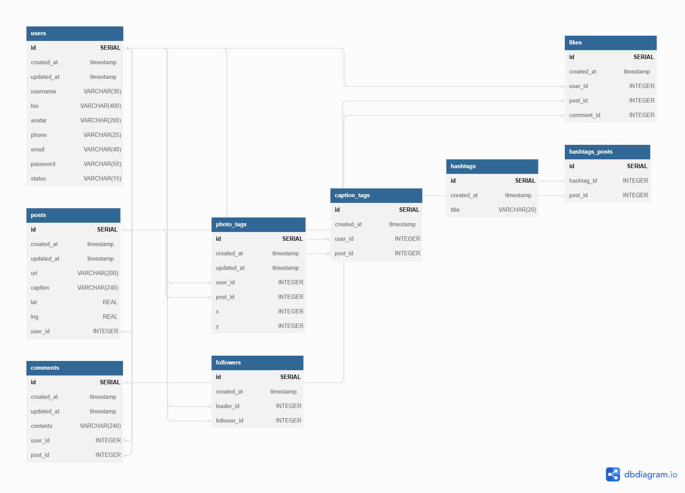

<div id="top"></div>

<div style="text-align:center"></div>

## 1. Introduction

### 1.1 Overview

The goal of this project is to create a social media platform that allows users
to share photos, videos, and messages with each other. The platform will provide
users with a simple and intuitive interface that makes it easy to upload and
view content, as well as interact with other users through comments and likes.


The platform will be built using PostgreSQL, a powerful and reliable database
management system that provides efficient and secure data storage. The data will
be accessed and manipulated using SQL, a standard programming language for
managing relational databases.


In addition to the basic features of the platform, we will also implement some
advanced features such as photo and caption tagging, hashtagging, and user
following. These features will help users to find and organize content, and also
to connect with other users who share similar interests.


Overall, this project aims to create a fun and engaging social media platform
that offers a wide range of features to its users, while also maintaining high
levels of security and reliability.


### 1.2 Technologies

<ins>RDD Design Tool</ins>: [DBDiagram](dbdiagram.io)

<ins>RDBMS</ins>: [PostgreSQL](postgresql.org)


## 2. Database Design

### 2.1 Structure

<p align="center">
  
</p>

### 2.2.1 User Table:

This table contains information about the users of the application.
It has columns for id, created_at, updated_at, username, bio, avatar, phone,
email, password, and status. id is a unique identifier for each user, created_at
and updated_at store the date and time when the user was created or updated,
username is the user's name, bio is a short description of the user, avatar is
the URL of the user's profile picture, phone is the user's phone number, email
is the user's email address, password is the user's password, and status
indicates the user's current status. The CHECK constraint ensures that at least
one of phone or email is not null.


### 2.2.2 Posts Table:

This table contains information about the posts created by the
users. It has columns for id, created_at, updated_at, url, caption, lat, lng,
and user_id. id is a unique identifier for each post, created_at and updated_at
store the date and time when the post was created or updated, url is the URL of
the post's image, caption is the post's caption, lat and lng are the post's
location coordinates, and user_id is the identifier of the user who created the
post.

### 2.2.3 Comments Table:

This table contains information about the comments created on
posts. It has columns for id, created_at, updated_at, contents, user_id, and
post_id. id is a unique identifier for each comment, created_at and updated_at
store the date and time when the comment was created or updated, contents is the
text of the comment, user_id is the identifier of the user who created the
comment, and post_id is the identifier of the post on which the comment was
created.

### 2.2.4 Likes Table:

This table contains information about the likes given by users on posts and
comments. It has columns for id, created_at, user_id, post_id, and comment_id.
id is a unique identifier for each like, created_at stores the date and time
when the like was created, user_id is the identifier of the user who gave the
like, and either post_id or comment_id is the identifier of the post or comment
that was liked. The CHECK constraint ensures that a like can be given only to a
post or a comment, but not both at the same time. The UNIQUE constraint ensures
that a user can like a post or a comment only once.

### 2.2.5 Photo Tags:

This table contains information about the tags given by users
on posts' images. It has columns for id, created_at, updated_at, user_id,
post_id, x, and y. id is a unique identifier for each photo tag, created_at and
updated_at store the date and time when the tag was created or updated, user_id
is the identifier of the user who created the tag, post_id is the identifier of
the post on which the tag was created, and x and y are the coordinates of the
tag's position on the image. The UNIQUE constraint ensures that a user can tag a
post's image only once.

### 2.2.6 Caption Tags Table:

This table contains information about the tags given by
users in posts' captions. It has columns for id, created_at, user_id, and
post_id. id is a unique identifier for each caption tag, created_at stores the
date and time when the tag was created, user_id is the identifier of the user
who created the tag, and post_id is the identifier of the post on which the tag
was created. The UNIQUE constraint ensures that a user can tag a post's caption
only once.

### 2.2.6 Hashtags Table:

This table contains information about the hashtags used in
posts' captions. It has columns for id, created_at, and title. id is a unique
identifier for each hashtag, created_at stores the date and time when the
hashtag was created, and title is the text of the hashtag. The UNIQUE constraint
ensures that a hashtag can be used only once.

### 2.2.7 Hashtag Posts Table:

This table associates posts with hashtags. It has columns for id, hashtag_id,
and post_id. id is a unique identifier for each row, hashtag_id is the
identifier of the hashtag associated with the post, and post_id is the
identifier of the post associated with the hashtag. The UNIQUE constraint
ensures that a post can be associated with a hashtag only once.

### 2.2.8 Followers Table:

followers table: This table contains information about the followers of the
users. It has columns for id, created_at, leader_id, and follower_id. id is a
unique identifier for each row, created_at stores the date and time when the
follower relation was created, leader_id is the identifier of the user who is
being followed, and follower_id is the identifier of the user who is following.
The UNIQUE constraint ensures that a user can follow another user only once.


### 2.3 Mock Data

`data.sql` can be restored as mock data into the database.


## 3. Queries

### 3.1 Count all the users:

```sql
SELECT COUNT(*)
FROM users;
```


<ins>Output</ins>:

```bash
5345
```

---

### 3.2 Count all the likes:

```sql
SELECT COUNT(*)
FROM likes;
```

<ins>Output</ins>:

```bash
752009
```

---

### 3.3 Grab the last 3 users:

```sql
SELECT *
FROM users
ORDER BY id DESC
LIMIT 3;
```

<ins>Output</ins>:

| id | created_at  | updated_at  | username | bio | avatar  | phone | email | password  | status  |
|------:|:------|:--------|:---------|:--------|:----------|:-------|:---------|:--------|:--------|
|  5345 | 2011-11-30 05:18:11.917+02  | 2011-11-30 05:18:11.917+02  | Osborne14           | Non facere architecto.                        | https://s3.amazonaws.com/uifaces/faces/twitter/ryhanhassan/128.jpg | NULL      | Gavin_Daniel@yahoo.com      | d1_LFZMQKyGN3YP    | online  |
|  5344 | 2011-08-07 13:48:18.008+03  | 2011-08-07 13:48:18.008+03  | Desmond.Armstrong42 | Sequi aut voluptas sapiente doloremque est dolor dolores. | https://s3.amazonaws.com/uifaces/faces/twitter/cofla/128.jpg   | NULL      | Jarred_Bradtke@gmail.com    | zOKCchSaNzpIvxU   | offline |
|  5343 | 2014-12-04 02:23:43.181+02  | 2014-12-04 02:23:43.181+02  | Marshall_Rogahn3    | NULL                                          | https://s3.amazonaws.com/uifaces/faces/twitter/mtolokonnikov/128.jpg | 56654757  | NULL                         | NULL               | online  |


---

### 3.4 Captions of Posts by a specific user:

```sql
SELECT username, caption
FROM users
JOIN posts ON posts.user_id = users.id
WHERE posts.user_id = 200;
```

<ins>Output</ins>:

| username  | caption                                                                                          |
|-----------|--------------------------------------------------------------------------------------------------|
| Casandra60| #benchmark #cristina @Lauriane.Parker19                                                         |
| Casandra60| #rerum @Margarete.Rau                                                                            |
| Casandra60| eum autem et #citlalli #anabelle #whiteboard #out-of-the-box #dolore #mindshare @Domingo_Stroman @Pascale.Bauch


---

### 3.5 Likes Per User

```sql
SELECT username, COUNT(*)
FROM users
JOIN likes ON likes.user_id = users.id
GROUP BY username;
```

<ins>Output</ins>:

> Displaying only the top 10 for the documentation.

| username            | count |
|---------------------|-------|
| Desmond.Armstrong42 | 152   |
| Cortez_Schiller     | 150   |
| Angela61            | 160   |
| Meredith26          | 136   |
| Gail45              | 140   |
| Marquis.Johnson52   | 145   |
| Arthur30            | 146   |
| Dedrick73           | 143   |
| Napoleon_Nikolaus   | 141   |


<!-- CONTACT -->
## 4. Contact

Erol Gelbul - [Website](http://www.erolgelbul.com)

Project Link: [Image Zen DB](https://github.com/ErolGelbul/image_zen_db)

<p align="right">(<a href="#top">back to top</a>)</p>
